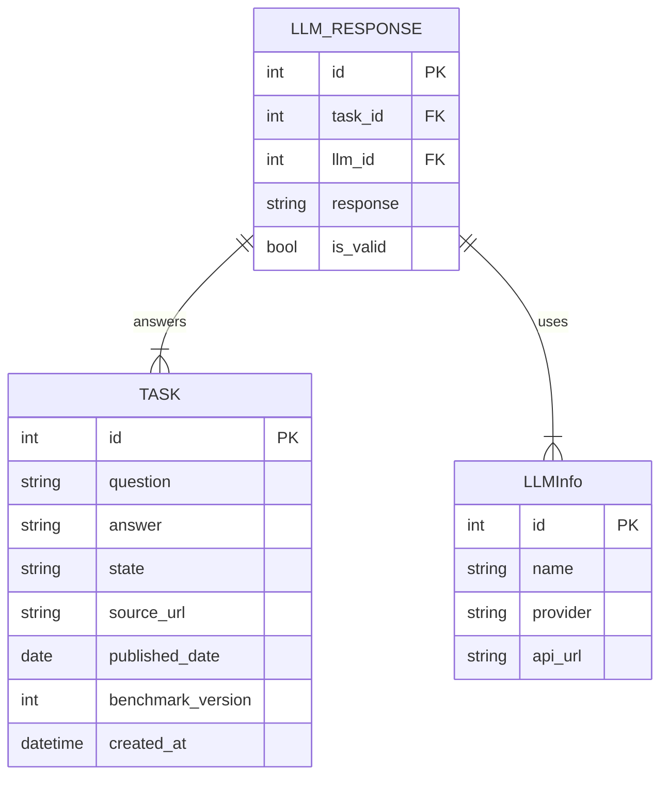

Структура базы данных

```mermaid
erDiagram
    LLM_RESPONSE ||--|{ TASK : "answers"
    LLM_RESPONSE ||--|{ LLMInfo : "uses"
    TASK {
        int id PK
        string question
        string answer
        string state
        string source_url
        date published_date
        int benchmark_version
        datetime created_at
    }
    LLM_RESPONSE {
        int id PK
        int task_id FK
        int llm_id FK
        string response
        bool is_valid
    }
    LLMInfo {
        int id PK
        string name
        string provider
        string api_url
    }
```
