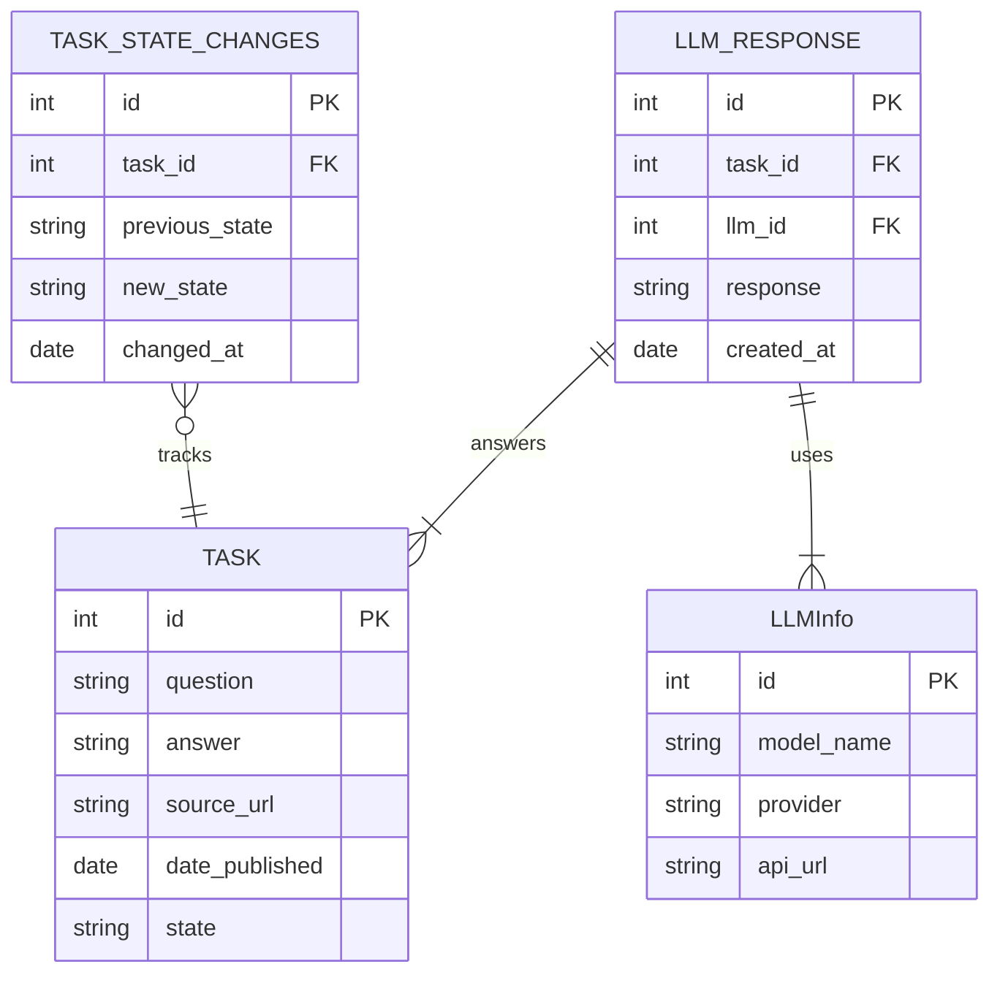

Структура базы данных

```mermaid
erDiagram
    TASK_STATE_CHANGES }o--|| TASK : "tracks"
    LLM_RESPONSE ||--|{ TASK : "answers"
    LLM_RESPONSE ||--|{ LLMInfo : "uses"
    TASK {
        int id PK
        string question
        string answer
        string source_url
        date date_published
        string state
    }
    TASK_STATE_CHANGES {
        int id PK
        int task_id FK
        string previous_state
        string new_state
        date changed_at
    }
    LLM_RESPONSE {
        int id PK
        int task_id FK
        int llm_id FK
        string response
        date created_at
    }
    LLMInfo {
        int id PK
        string model_name
        string provider
        string api_url
    }
```
