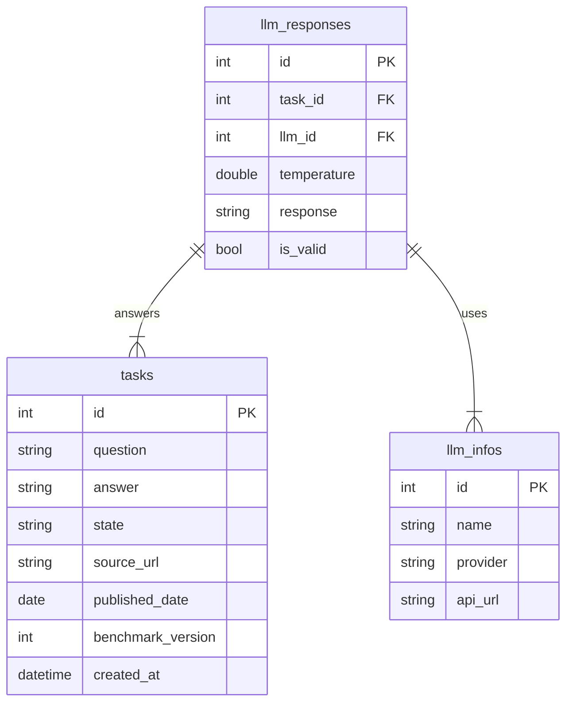

Структура базы данных

```mermaid
erDiagram
    llm_responses ||--|{ tasks : "answers"
    llm_responses ||--|{ llm_infos : "uses"
    tasks {
        int id PK
        string question
        string answer
        string state
        string source_url
        date published_date
        int benchmark_version
        datetime created_at
    }
    llm_responses {
        int id PK
        int task_id FK
        int llm_id FK
        double temperature
        string response
        bool is_valid
    }
    llm_infos {
        int id PK
        string name
        string provider
        string api_url
    }
```
